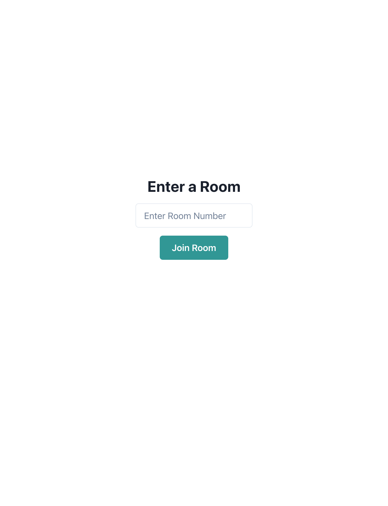

# GoChat

## Introduction
Welcome to GoChat! This application is a real-time chat platform utilizing WebSockets, built with Go and React to deliver a responsive user experience.

## Features
- Front-end: React(ts)
- Backend: Go
- OAuth (with your Google account)
- Real-time chat using websocket
- Chat rooms separated by number
- User-friendly screen using chakraui

## Getting Started

### Prerequisites
- Node.js
- Go
- A Google account for OAuth authentication.
##### Google Cloud Console Setup for OAuth
To use OAuth with Google, you need to register your application in the Google Cloud Console. Follow these steps:
1. Visit the [Google Cloud Console](https://console.cloud.google.com/).
2. Create a new project or select an existing project.
3. Navigate to "APIs & Services" > "Credentials".
4. Click on "Create Credentials" and select "OAuth client ID".
5. Configure the consent screen as required.
6. Set the authorized JavaScript origins and redirect URIs:  
JavaScript origins: http://localhost:3000  
Redirect URIs: http://localhost:9090/api/callback
9. After creating the credentials, you will receive your client ID and client secret which you should add to your .env file.

### Installation
1. Clone the repository:
   ```bash
   git clone https://github.com/yourusername/GoChat.git
2. Move into the project directory: 
    ```bash
    cd GoChat
3. Install the necessary dependencies:
    ```bash
    (cd web; npm install)
4. Place the .env file in the root directory, copy the contents of the .env_sample and add values. (OAUTH_CLIENT_ID and OAUTH_CLIENT_SECRET are taken from those registered in [Prerequisites](#google-cloud-console-setup-for-oauth).)
    ```text
    OAUTH_CLIENT_ID=(your_client_id_here)
    OAUTH_CLIENT_SECRET=(your_client_secret_here)
    SESSION_KEY=s(et_your_secure_random_value_here)

## Run
Prepare two command prompts.  
In case you are root directory of GoChat

1. To start the backend server:
    ```bash
   go run ./cmd/gochat/main.go
2. To start the frontend server:
    ```bash
   (cd web; npm start)
3. Go to http://localshost:3000  
   Then you will see my ~~cute Pokémon~~ character and the app start screen.

### Login Screen


### Google Authentication Screen


### After Authentication Screen


### Room Selection Screen


### Chat Room Screen


### Sample Talk
https://github.com/Chanmachan/GoChat/assets/103916725/0406df5d-5aac-4846-a89e-83a2eae37530

